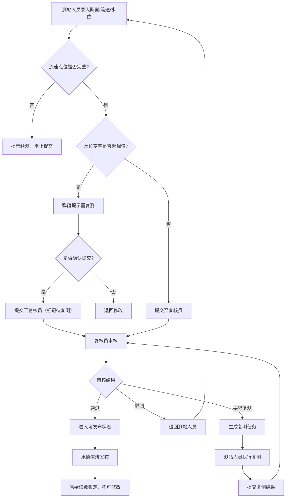

## 1. 产品概述

水文测流作业复核系统——面向水文测站的三角色协作平台，实现测流数据从录入、复核、复测到发布的全流程管控，确保水情数据的准确性与可追溯性。

- 解决测流数据质量管控问题：流速点位缺测拦截、水位突变复测、发布后原始数据不可篡改
- 目标用户：测站人员、复核员、水情值班员

## 2. 核心功能

### 2.1 用户角色

| 角色 | 注册方式 | 核心权限 |
|------|----------|----------|
| 测站人员 | 管理员分配账号 | 登记断面/流速/水位，提交测次，发起复测 |
| 复核员 | 管理员分配账号 | 审核测次质量，通过/驳回，要求复测 |
| 水情值班 | 管理员分配账号 | 发布水情数据，查看已发布成果 |

### 2.2 功能模块

1. **测次录入页面**：断面信息登记、流速点位录入、水位录入、提交校验
2. **测次复核页面**：待复核列表、质量审核、通过/驳回操作、要求复测标记
3. **复测页面**：复测任务列表、重新录入数据、复测原因追踪
4. **水情发布页面**：已通过测次列表、发布操作、已发布成果查看
5. **仪表盘首页**：测次统计、待办提醒、近期数据概览

### 2.3 页面详情

| 页面名称 | 模块名称 | 功能描述 |
|----------|----------|----------|
| 仪表盘 | 统计卡片 | 今日测次、待复核数、待发布数、已发布数 |
| 仪表盘 | 待办提醒 | 角色相关的待办任务列表 |
| 仪表盘 | 近期测次 | 最近7天测次趋势图 |
| 测次录入 | 断面信息 | 断面名称、断面编号、施测日期、天气 |
| 测次录入 | 流速点位 | 点位编号、起点距、水深、流速、测法（积点法/积深法），缺测点位标红不可提交 |
| 测次录入 | 水位信息 | 起始水位、终止水位、平均水位，水位变率超阈值弹窗提示复测 |
| 测次录入 | 提交校验 | 流速点位完整性校验、水位变率校验，不通过则阻止提交 |
| 测次复核 | 待复核列表 | 按时间排序的待复核测次，支持筛选 |
| 测次复核 | 质量审核 | 查看断面/点位/水位详情，审核意见填写 |
| 测次复核 | 审核操作 | 通过→进入可发布状态；驳回→退回测站人员；要求复测→生成复测任务 |
| 复测管理 | 复测任务列表 | 待复测/复测中/已完成状态筛选 |
| 复测管理 | 重新录入 | 保留原始断面，重新录入流速/水位数据 |
| 复测管理 | 原因追踪 | 显示复测原因、发起人、关联原始测次 |
| 水情发布 | 可发布列表 | 复核通过的测次，一键发布 |
| 水情发布 | 已发布成果 | 发布后数据只读，原始读数不可修改 |
| 水情发布 | 发布记录 | 发布时间、操作人、数据快照 |

## 3. 核心流程

测站人员在测次录入页面登记断面、流速点位和水位数据。系统校验流速点位是否完整（缺测不可提交）、水位变率是否超阈值（超阈值弹窗提示需复测）。校验通过后提交至复核员。复核员审核测次质量，可选择通过、驳回或要求复测。通过后进入可发布状态，水情值班员执行发布。发布后的测流成果原始读数锁定，不可修改。如需更正，须发起复测流程。

## 4. 用户界面设计

### 4.1 设计风格

- **主色**：深海蓝 `#0C4A6E`，体现水文专业性
- **辅色**：天际青 `#06B6D4`，用于交互高亮与状态指示
- **警告色**：琥珀橙 `#F59E0B`，用于校验警告与复测标记
- **危险色**：赤红 `#EF4444`，用于错误与阻止操作
- **背景**：浅灰白 `#F8FAFC`，搭配深色侧边栏
- **按钮风格**：圆角8px，主按钮填充色，次按钮描边
- **字体**：正文 14px 系统字体，标题 20px/24px 粗体
- **布局风格**：左侧固定侧边栏导航 + 右侧主内容区
- **图标风格**：线性图标（lucide-react），与水文/水滴/河流主题呼应

### 4.2 页面设计概览

| 页面名称 | 模块名称 | UI要素 |
|----------|----------|--------|
| 仪表盘 | 统计卡片 | 四宫格卡片，数字大号粗体，底部趋势小图 |
| 仪表盘 | 待办提醒 | 列表卡片，左侧角色图标，右侧操作按钮 |
| 仪表盘 | 近期测次 | 面积图，蓝青渐变填充 |
| 测次录入 | 断面信息 | 表单卡片，输入框带图标前缀 |
| 测次录入 | 流速点位 | 可编辑表格，缺测行红色高亮+警告图标 |
| 测次录入 | 水位信息 | 内联表单，水位变率超阈值橙色提示条 |
| 测次录入 | 提交校验 | 底部固定操作栏，校验不通过时按钮禁用+提示 |
| 测次复核 | 待复核列表 | 表格+状态标签，左侧筛选面板 |
| 测次复核 | 质量审核 | 右侧抽屉详情面板，含数据图表 |
| 测次复核 | 审核操作 | 三个操作按钮：通过(绿)/驳回(灰)/复测(橙) |
| 复测管理 | 复测任务列表 | 三列看板：待复测/复测中/已完成 |
| 复测管理 | 重新录入 | 复用录入表单，顶部显示复测原因横幅 |
| 水情发布 | 可发布列表 | 表格+发布按钮，发布确认弹窗 |
| 水情发布 | 已发布成果 | 只读表格，原始数据列带锁图标 |
| 水情发布 | 发布记录 | 时间线组件，显示操作轨迹 |

### 4.3 响应式设计

- 桌面优先设计，侧边栏导航在大屏固定展开
- 平板端侧边栏可折叠，内容区自适应
- 移动端侧边栏收起为汉堡菜单，表格改为卡片列表

### 4.4 3D场景指导

不适用
