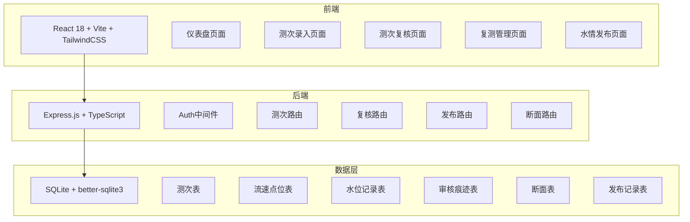
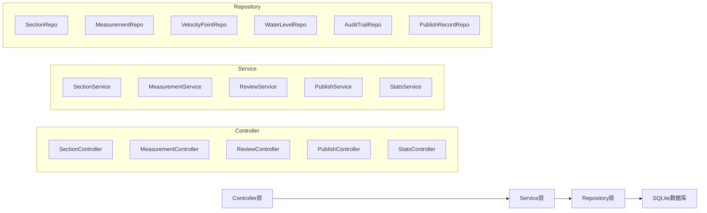
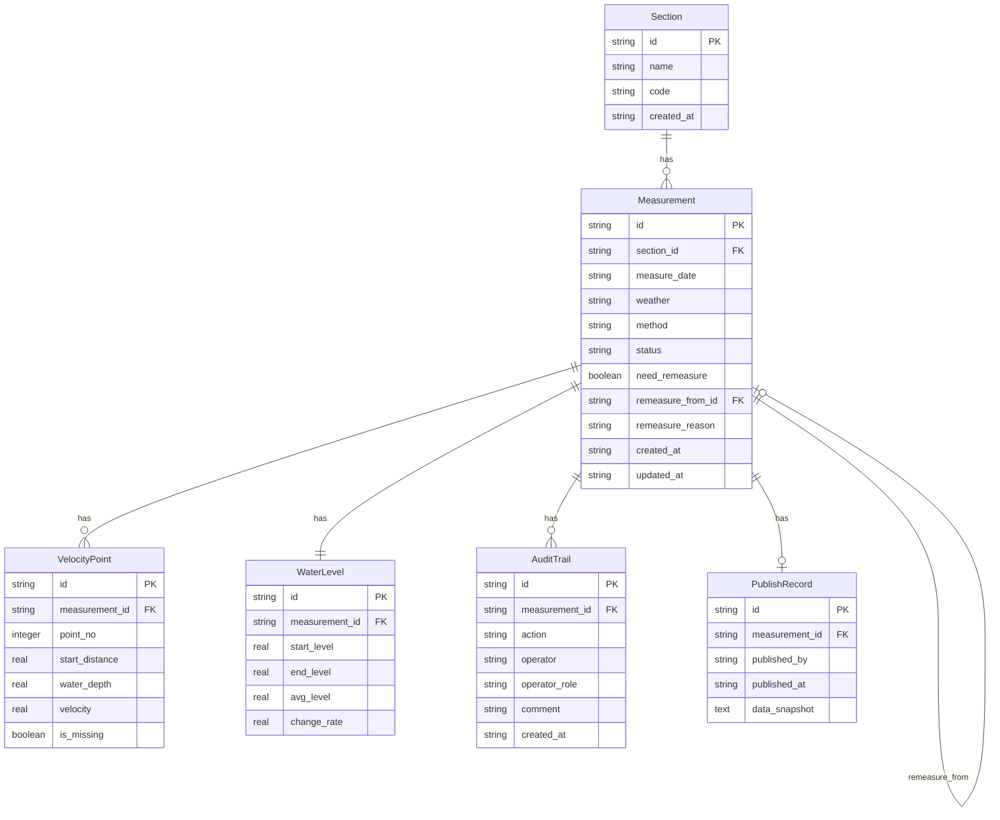

## 1. 架构设计



## 2. 技术说明

- **前端**：React@18 + TailwindCSS@3 + Vite + Zustand + React Router
- **初始化工具**：vite-init (react-express-ts 模板)
- **后端**：Express@4 + TypeScript (ESM)
- **数据库**：SQLite (better-sqlite3)，开发阶段轻量部署
- **图表**：Recharts 面积图/趋势图
- **图标**：lucide-react
- **日期处理**：date-fns

## 3. 路由定义

| 路由 | 用途 |
|------|------|
| `/` | 仪表盘首页，统计概览与待办 |
| `/measure/new` | 新建测次录入 |
| `/measure/:id` | 查看测次详情 |
| `/review` | 测次复核列表 |
| `/review/:id` | 复核详情与操作 |
| `/remeasure` | 复测任务列表 |
| `/remeasure/:id` | 执行复测 |
| `/publish` | 水情发布管理 |

## 4. API定义

### 4.1 断面相关

```
GET    /api/sections          — 获取断面列表
POST   /api/sections          — 新增断面
GET    /api/sections/:id      — 获取断面详情
```

### 4.2 测次相关

```
GET    /api/measurements              — 获取测次列表（支持状态筛选）
POST   /api/measurements              — 新建测次（含点位+水位）
GET    /api/measurements/:id           — 获取测次详情（含点位+水位+审核记录）
PUT    /api/measurements/:id           — 更新测次（仅草稿状态）
DELETE /api/measurements/:id           — 删除测次（仅草稿状态）
POST   /api/measurements/:id/submit    — 提交测次（触发校验）
```

### 4.3 复核相关

```
GET    /api/reviews                    — 获取待复核列表
POST   /api/reviews/:measurementId/approve  — 复核通过
POST   /api/reviews/:measurementId/reject   — 复核驳回
POST   /api/reviews/:measurementId/remeasure — 要求复测
GET    /api/measurements/:id/audit-trail     — 获取审核痕迹
```

### 4.4 发布相关

```
GET    /api/publish                    — 获取可发布/已发布列表
POST   /api/publish/:measurementId     — 发布测次
GET    /api/publish/:measurementId/record — 获取发布记录
```

### 4.5 统计相关

```
GET    /api/stats/dashboard            — 仪表盘统计数据
```

### 4.6 TypeScript类型定义

```typescript
interface Section {
  id: string;
  name: string;
  code: string;
  createdAt: string;
}

interface Measurement {
  id: string;
  sectionId: string;
  measureDate: string;
  weather: string;
  method: 'point_integration' | 'depth_integration';
  status: 'draft' | 'submitted' | 'approved' | 'rejected' | 'remeasure' | 'published';
  needRemeasure: boolean;
  remeasureFromId: string | null;
  remeasureReason: string | null;
  createdAt: string;
  updatedAt: string;
}

interface VelocityPoint {
  id: string;
  measurementId: string;
  pointNo: number;
  startDistance: number;
  waterDepth: number;
  velocity: number | null;
  isMissing: boolean;
}

interface WaterLevel {
  id: string;
  measurementId: string;
  startLevel: number;
  endLevel: number;
  avgLevel: number;
  changeRate: number;
}

interface AuditTrail {
  id: string;
  measurementId: string;
  action: 'submit' | 'approve' | 'reject' | 'remeasure' | 'publish';
  operator: string;
  operatorRole: 'station' | 'reviewer' | 'duty';
  comment: string | null;
  createdAt: string;
}

interface PublishRecord {
  id: string;
  measurementId: string;
  publishedBy: string;
  publishedAt: string;
  dataSnapshot: string;
}
```

## 5. 服务端架构图



## 6. 数据模型

### 6.1 数据模型定义



### 6.2 数据定义语言

```sql
CREATE TABLE sections (
  id TEXT PRIMARY KEY,
  name TEXT NOT NULL,
  code TEXT NOT NULL UNIQUE,
  created_at TEXT NOT NULL DEFAULT (datetime('now'))
);

CREATE TABLE measurements (
  id TEXT PRIMARY KEY,
  section_id TEXT NOT NULL REFERENCES sections(id),
  measure_date TEXT NOT NULL,
  weather TEXT NOT NULL DEFAULT '',
  method TEXT NOT NULL CHECK(method IN ('point_integration', 'depth_integration')),
  status TEXT NOT NULL DEFAULT 'draft' CHECK(status IN ('draft','submitted','approved','rejected','remeasure','published')),
  need_remeasure INTEGER NOT NULL DEFAULT 0,
  remeasure_from_id TEXT REFERENCES measurements(id),
  remeasure_reason TEXT,
  created_at TEXT NOT NULL DEFAULT (datetime('now')),
  updated_at TEXT NOT NULL DEFAULT (datetime('now'))
);
CREATE INDEX idx_measurements_status ON measurements(status);
CREATE INDEX idx_measurements_section ON measurements(section_id);

CREATE TABLE velocity_points (
  id TEXT PRIMARY KEY,
  measurement_id TEXT NOT NULL REFERENCES measurements(id) ON DELETE CASCADE,
  point_no INTEGER NOT NULL,
  start_distance REAL NOT NULL,
  water_depth REAL NOT NULL,
  velocity REAL,
  is_missing INTEGER NOT NULL DEFAULT 0
);
CREATE INDEX idx_velocity_points_measurement ON velocity_points(measurement_id);

CREATE TABLE water_levels (
  id TEXT PRIMARY KEY,
  measurement_id TEXT NOT NULL UNIQUE REFERENCES measurements(id) ON DELETE CASCADE,
  start_level REAL NOT NULL,
  end_level REAL NOT NULL,
  avg_level REAL NOT NULL,
  change_rate REAL NOT NULL
);

CREATE TABLE audit_trails (
  id TEXT PRIMARY KEY,
  measurement_id TEXT NOT NULL REFERENCES measurements(id),
  action TEXT NOT NULL CHECK(action IN ('submit','approve','reject','remeasure','publish')),
  operator TEXT NOT NULL,
  operator_role TEXT NOT NULL CHECK(operator_role IN ('station','reviewer','duty')),
  comment TEXT,
  created_at TEXT NOT NULL DEFAULT (datetime('now'))
);
CREATE INDEX idx_audit_trails_measurement ON audit_trails(measurement_id);

CREATE TABLE publish_records (
  id TEXT PRIMARY KEY,
  measurement_id TEXT NOT NULL UNIQUE REFERENCES measurements(id),
  published_by TEXT NOT NULL,
  published_at TEXT NOT NULL DEFAULT (datetime('now')),
  data_snapshot TEXT NOT NULL
);

-- 初始断面数据
INSERT INTO sections (id, name, code) VALUES
  ('sec-001', '望江楼断面', 'WJL-001'),
  ('sec-002', '镇江关断面', 'ZJG-002'),
  ('sec-003', '青神断面', 'QS-003');
```
